# AgriShield AI Backend Architecture

## Overview
The backend uses a strict Layered Architecture inside feature-based modules:
- `src/modules/dashboard`: Real-time dashboard aggregates
- `src/modules/detection`: Animal detection ingestion
- `src/modules/health`: Basic health checks
- `src/modules/profile`: User profile management
- `src/modules/settings`: Application preferences
- `src/modules/notification`: Notification logic and device tracking

### Notification Dispatch Flow
Notifications are deeply decoupled.

```mermaid
flowchart TD
    A[Detection Module] -->|Emits DETECTION_CREATED| B(DomainEvents)
    B --> C[NotificationService]
    C -->|Stores in DB| D[(PostgreSQL)]
    C -->|Emits NOTIFICATION_CREATED| E(DomainEvents)
    E --> F[NotificationDispatcher]
    F -->|Fetches Preferences| G[SettingsRepository]
    F -->|Dispatches via Providers| H{Providers}
    H --> I[Firebase Push]
    H --> J[Browser WebSocket]
    H --> K[Voice Alert]
    H --> L[Dashboard]
```

1. Any module emits a domain event (e.g. `DETECTION_CREATED`).
2. `notification.events.ts` catches it and creates a `Notification` entity in DB via `NotificationService`.
3. `NotificationService` emits a `NOTIFICATION_CREATED` event.
4. `NotificationDispatcher` listens to `NOTIFICATION_CREATED`.
5. `NotificationDispatcher` fetches user preferences from `SettingsRepository`.
6. If enabled, it resolves device tokens and pushes to `FirebaseNotificationProvider`.

Every module strictly follows:
`index.ts, routes.ts, controller.ts, service.ts, repository.ts, validator.ts, types.ts`

## Layers & Dependency Injection
1. **Controller**: Handles HTTP request parsing, validates via Zod, forwards payloads to Services, and formats responses via `ApiResponse`.
2. **Service**: Contains pure business logic. Receives repositories via Constructor Injection. Never touches `req` or `res`. Extends `BaseService`.
3. **Repository**: Handles SQL query construction and interacts directly with PostgreSQL. Exposes only business-oriented methods (`findUserByEmail()`).

## AI Integration
AI is abstracted via `AiProvider`. Both `DummyAiProvider` and `FastApiProvider` return the exact same `DetectionResult` contract. Controllers/Services must never know which implementation is active.

## Domain Events
A centralized `DomainEvents` emitter handles decoupling cross-module workflows (e.g. `DETECTION_CREATED` triggers `ALERT_TRIGGERED`).
