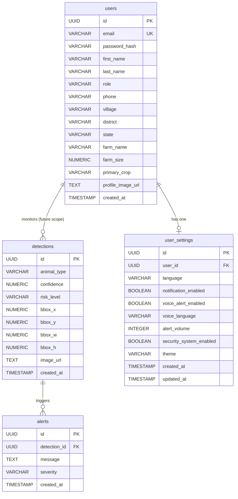

# AgriShield AI Database Architecture

## Connection Management
PostgreSQL connections are managed via a `pg` pool located in `src/database/pool.ts`.

## Transactions
A Shared Transaction Manager (`src/database/transaction.ts`) provides a `runInTransaction` wrapper to handle `BEGIN`, `COMMIT`, and `ROLLBACK` for atomic operations.

## Query Execution
All SQL queries are executed manually using parameterized queries. 

## Strict SQL Standards
- MUST use parameterized placeholders (`$1`, `$2`).
- MUST NOT use `SELECT *`. Explicitly list selected columns.
- MUST NOT concatenate strings for queries.
- MUST use descriptive aliases where needed.

## Constraints
- No ORMs (Prisma, TypeORM, etc.).
- SQL belongs strictly in the Repository layer (`modules/*/repository.ts`).
- Repositories must not contain business logic.

## Entity Relationship Diagram

